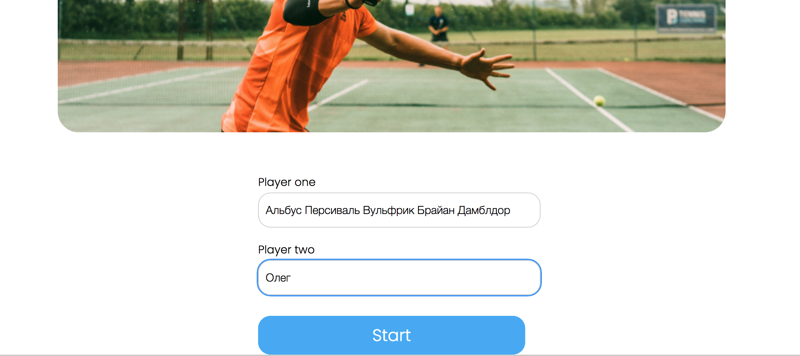
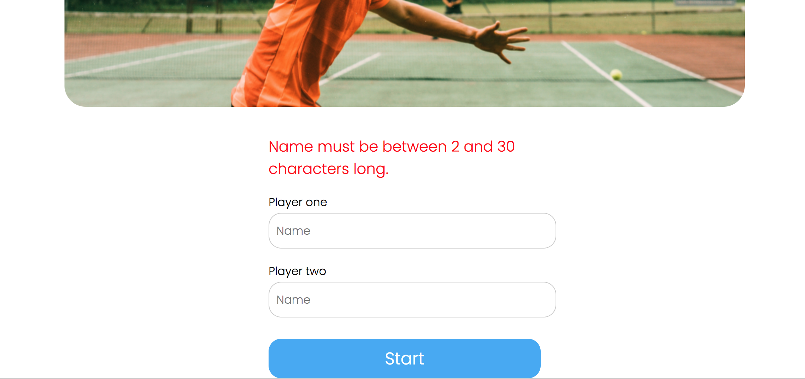
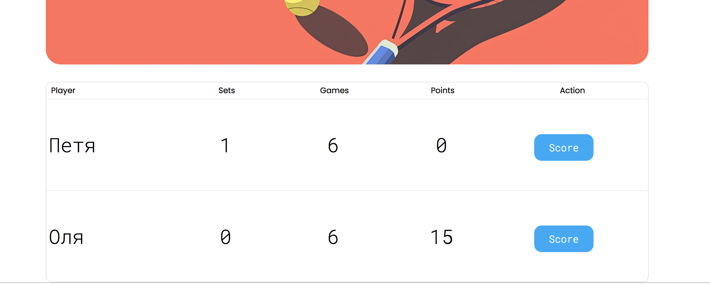
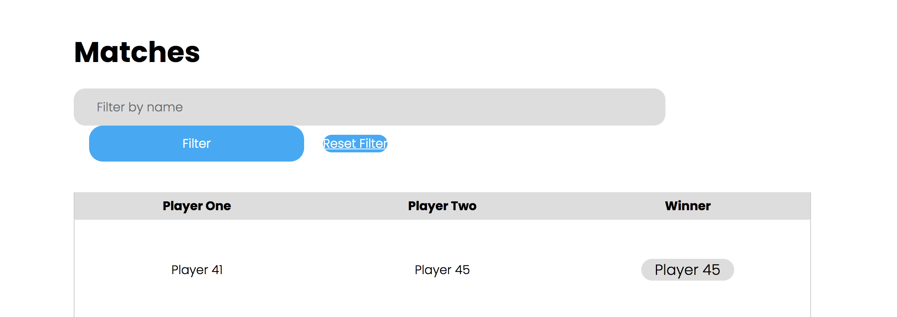
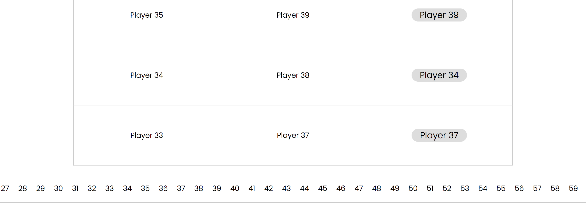

```text
Знаком ❗️ помечены критически важные замечания, а также места нарушения ТЗ.
```

## Функциональный обзор

- При использовании недопустимого имени, оно не сохраняется в поле ввода и приходится заново его печатать.





При ошибке лучше оставлять текст в поле ввода — это улучшит пользовательский опыт.

- При счёте 6-6 в сете должен начинаться так-брейк. Но сейчас продолжается счёт 15-30-40, как будто идёт ещё один гейм и только затем начинается счёт тай-брейка.



- Кнопку сброса фильтра лучше сделать таким же размером, как и кнопку его применения



- ❗️В пагинации на странице завершённых матчей отображаются все страницы, что плохо выглядит при большом количестве страниц и делает недоступными страницы за пределами экрана.



Лучше сделать отображение текущей и +-2 страниц вокруг неё.

